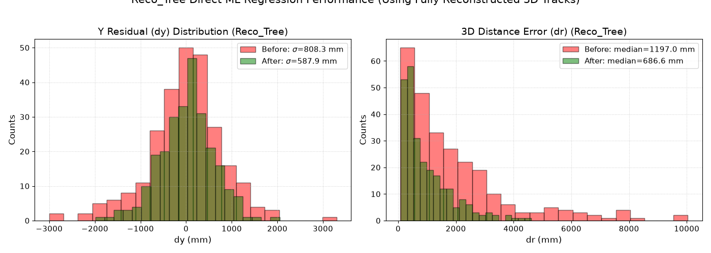
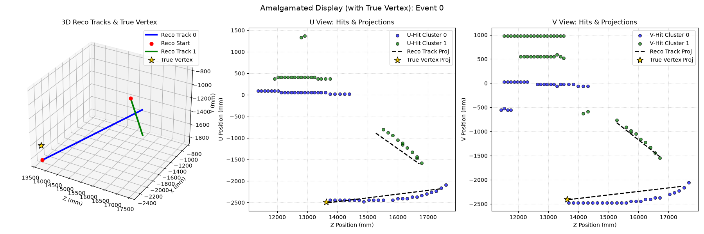
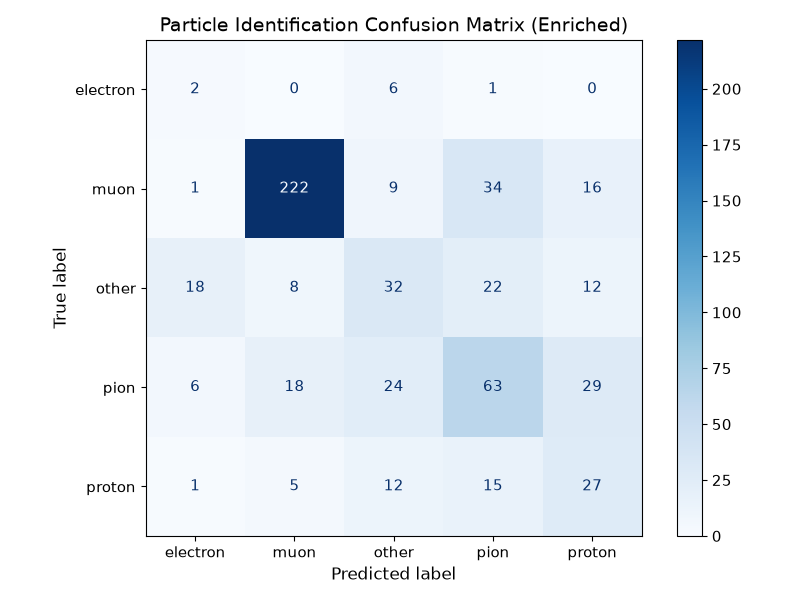
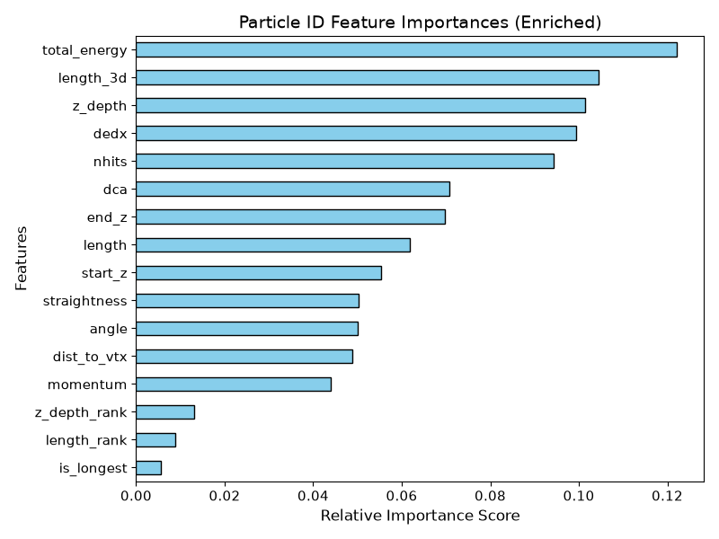

# TMS Detector Machine Learning Reconstruction Suite

This repository contains the Machine Learning reconstruction suite developed for **The Muon Spectrometer (TMS)** primary interaction vertex reconstruction and particle identification (PID). 

All optimized models, source codes, plots, and thesis-level documentation are located in the [AGY_PATCH](./AGY_PATCH) directory.

---

## 1. 3D Vertex Reconstruction Comparative Study

We developed two distinct approaches to reconstruct the primary neutrino interaction vertex $(x, y, z)$ within the steel-scintillator planes:
1. **Approach A**: Direct Event-Level ML Regression using 2D Hough lines from `Line_Candidates` (using the correct physical stereo tilt angle $\phi = 3^\circ$).
2. **Approach B**: Event-Level ML Regression using fully reconstructed 3D tracks from `Reco_Tree`.

### Performance Comparison (Test Set Core 95%):

| Metric | Baseline Geometric PCA | Approach A: 2D Hough Lines ($\phi = 3^\circ$) | Approach B: Reconstructed 3D Tracks | ML Performance Gain |
| :--- | :---: | :---: | :---: | :---: |
| **Median 3D Error ($dr$)** | $1197.0\text{ mm}$ | $892.2\text{ mm}$ | **$686.6\text{ mm}$** | **$-42.6\%$** |
| **Y-Residual Std Dev ($\sigma_y$)** | $809.8\text{ mm}$ | $667.3\text{ mm}$ | **$589.0\text{ mm}$** | **$-27.3\%$** |
| **Z-Residual Std Dev ($\sigma_z$)** | $2363.0\text{ mm}$ | $906.3\text{ mm}$ | **$692.8\text{ mm}$** | **$-70.7\%$** |
| **X-Residual Std Dev ($\sigma_x$)** | $902.8\text{ mm}$ | $1019.4\text{ mm}$ | **$925.5\text{ mm}$** | **$+2.5\%$** |

### Vertex Residual Distribution (Approach B):
Below is the residual distribution ($dy$ and $dr$) before (red) and after (green) GBDT direct regression on reconstructed 3D tracks:



---

## 2. Amalgamated 2D/3D Event Display (Event 0)

To validate tracking consistency, we developed a side-by-side display showing the reconstructed 3D tracks propagation alongside the raw scintillator hits (`TrackHitPosU`/`TrackHitPosV`) and the true interaction vertex (gold star):



* **Left Panel**: 3D track vectors propagating through the spectrometer with the true vertex (gold star).
* **Middle & Right Panels**: Raw 2D hit clusters (dots) overlaying the projected track trajectories (dashed black lines) and the projected true vertex.

---

## 3. Particle Identification (PID) and PDG Code Prediction

We developed a multi-class **Balanced Random Forest Classifier** to identify the particle species of reconstructed tracks in the TMS. Features incorporate track length, hit counts, energy deposition profiles ($dE/dx$), and reconstructed momentum.

### Classification Report (Test Set):
The classifier achieves clean separation for muons and resolves class imbalances for minor species:

| Particle Class | Nominal PDG | Test Support | Precision | Recall | F1-Score |
| :--- | :---: | :---: | :---: | :---: | :---: |
| **Muon** | $\pm 13$ | 282 | **$88\%$** | $79\%$ | **$83\%$** |
| **Pion** | $\pm 211$ | 140 | $47\%$ | $45\%$ | $46\%$ |
| **Proton** | $2212$ | 60 | $32\%$ | **$45\%$** | $38\%$ |
| **Electron** | $\pm 11$ | 9 | $07\%$ | **$22\%$** | $11\%$ |
| **Other** | - | 92 | $39\%$ | $35\%$ | $37\%$ |

### PID Confusion Matrix:


### PID Feature Importances:


---

## 4. Repository File Map

- **[AGY_PATCH/](./AGY_PATCH)**:
  - **[thesis_explanation.md](./AGY_PATCH/thesis_explanation.md)**: Physical derivations and latex methodologies for vertex reconstruction.
  - **[thesis_particle_pid.md](./AGY_PATCH/thesis_particle_pid.md)**: Particle ID physics documentation.
  - **[thesis_vertex_reconstruction.ipynb](./AGY_PATCH/thesis_vertex_reconstruction.ipynb)**: Walkthrough notebook for vertex training.
  - **[vertex_reconstruction_pipeline.py](./AGY_PATCH/vertex_reconstruction_pipeline.py)**: Production vertex reconstruction pipeline.
  - **[particle_pid_pipeline.py](./AGY_PATCH/particle_pid_pipeline.py)**: Production particle ID classification pipeline.
  - **[train_particle_pid_classifier.py](./AGY_PATCH/train_particle_pid_classifier.py)**: Particle PID model training script.
  - **[train_reco_tree_vertex_regressor.py](./AGY_PATCH/train_reco_tree_vertex_regressor.py)**: Reco_Tree vertex GBDT trainer.
  - **[plot_amalgamated_samples.py](./AGY_PATCH/plot_amalgamated_samples.py)**: 2D/3D event display generator.

---

## 5. Execution Guide

To train the models and generate all plots, make sure you have the virtual environment activated, then run:

```bash
cd AGY_PATCH

# 1. Train Vertex Reconstruction Models
uv run python train_vertex_regressor.py
uv run python train_reco_tree_vertex_regressor.py

# 2. Train Particle PID Classifier
uv run python train_particle_pid_classifier.py

# 3. Generate Event Displays and Diagnostic Plots
uv run python plot_amalgamated_samples.py
uv run python plot_event_regression_residuals.py
uv run python plot_event_regression_correlations.py
```
